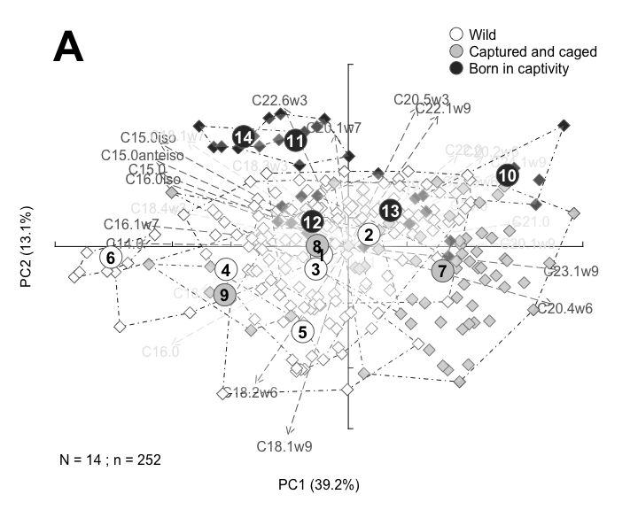
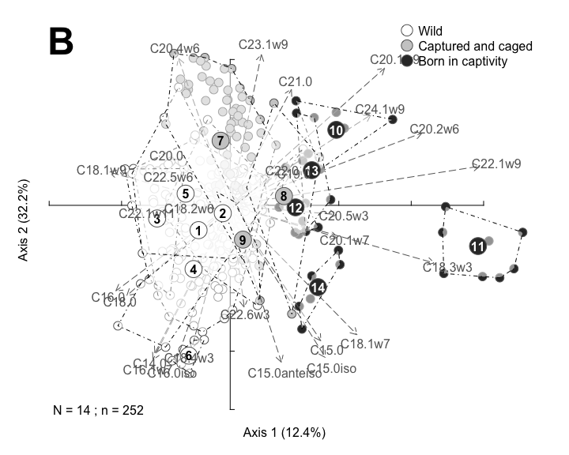
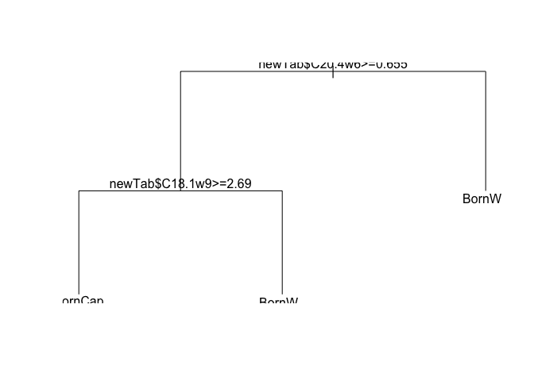
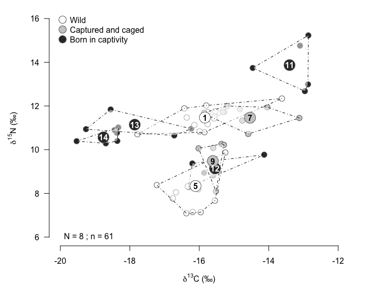
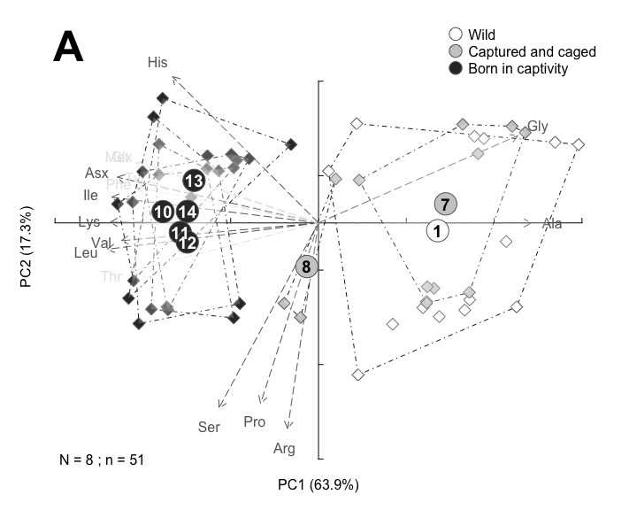
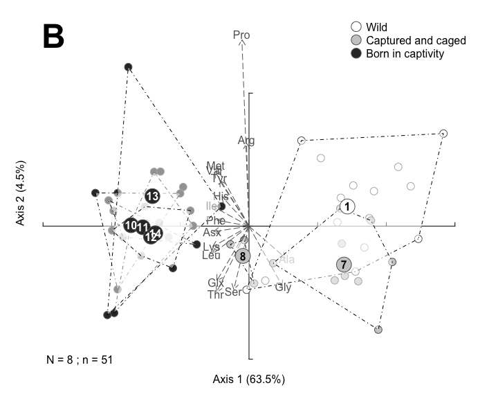
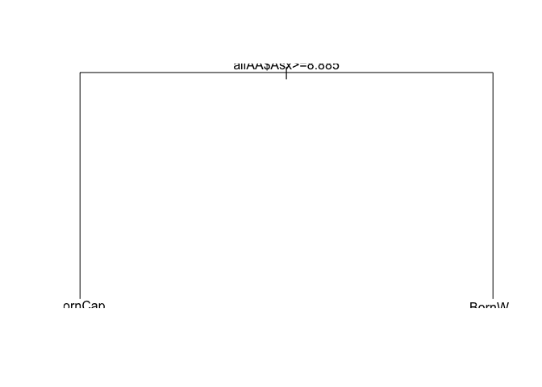
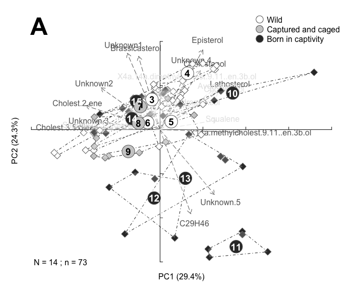
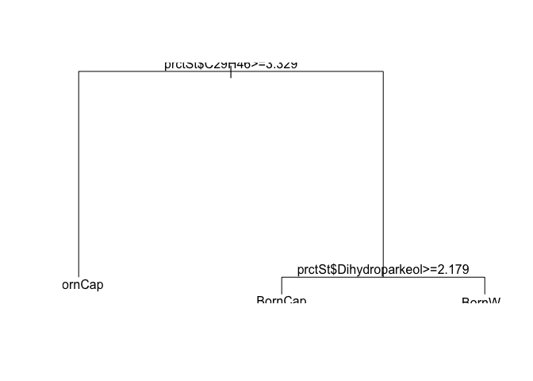
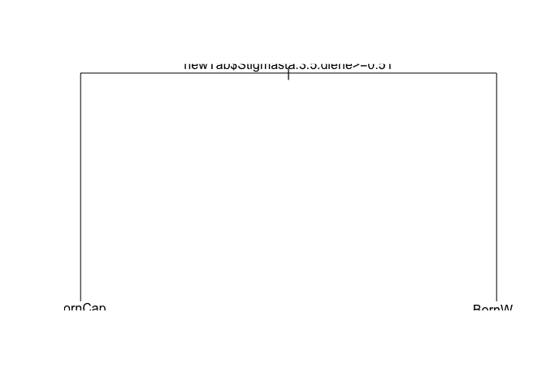

### R Markdown

This R Markdown document is made to support the findings of the paper "A screening of tools to differentiate wild vs. farmed sea cucumbers in multi-trophic aquaculture systems with no artificial feed inputs" by David et al. (2026).

Preparing the toolbox
---------------------

Let's begin by loading the libraries that we will require to run the analyses.

``` r
#library(agricolae)
#library(vegan)
library(ade4)
library(factoextra)
library(easyCODA)
library(pls)
library(rpart)
```

Loading the data
----------------

We load fatty acids, stable isotopes, amino acids and sterols data from the GitHub server.

For details on line and column headings please check the readme file.

``` r
FA <- read.csv("https://raw.githubusercontent.com/DAVID-Fk/Sea-cucumber-authenticity/main/FA_screening.csv", sep=";", header=T)
SI <- read.csv("https://raw.githubusercontent.com/DAVID-Fk/Sea-cucumber-authenticity/main/SI_screening.csv", sep=";", header=T)
AA <- read.csv("https://raw.githubusercontent.com/DAVID-Fk/Sea-cucumber-authenticity/main/AA_screening.csv", sep=";", header=T)
St <- read.csv("https://raw.githubusercontent.com/DAVID-Fk/Sea-cucumber-authenticity/main/St_screening.csv", sep=";", header=T)
```

Fatty acids
-----------

``` r
allFA=FA[,-c(1:7, which(colnames(FA)=="C23.0"))]
rownames(allFA)=FA[,1]
allFA[is.na(allFA)]=0

## Percentage table
prct=allFA/rowSums(allFA)*100

## Concentrations table 
conc=allFA/FA[,which(colnames(FA)=="C23.0")]*FA[,which(colnames(FA)=="StdC23")]/FA[,which(colnames(FA)=="SplMass")]
conctot=rowSums(conc)

# Let's define categories of FA

brFA=rowSums(prct[, c(which(colnames(prct)=="C15.0iso"), which(colnames(prct)=="C15.0anteiso"), which(colnames(prct)=="C16.0iso"))])
SFA=rowSums(prct[, c(which(colnames(prct)=="C14.0"), which(colnames(prct)=="C15.0"), which(colnames(prct)=="C16.0"), which(colnames(prct)=="C18.0"), which(colnames(prct)=="C19.0"),which(colnames(prct)=="C20.0"), which(colnames(prct)=="C21.0"), which(colnames(prct)=="C22.0"))])
PUFA=rowSums(prct[, c(which(colnames(prct)=="C18.2w6"), which(colnames(prct)=="C18.3w3"), which(colnames(prct)=="C18.4w3"), which(colnames(prct)=="C20.2w6"), which(colnames(prct)=="C20.4w6"), which(colnames(prct)=="C20.5w3"), which(colnames(prct)=="C22.5w6"), which(colnames(prct)=="C22.6w3"))])
HUFA=rowSums(prct[, c(which(colnames(prct)=="C20.4w6"), which(colnames(prct)=="C20.3w6"), which(colnames(prct)=="C20.5w3"), which(colnames(prct)=="C22.5w6"), which(colnames(prct)=="C22.6w3"))])
w3=rowSums(prct[, c(which(colnames(prct)=="C18.3w3"), which(colnames(prct)=="C18.4w3"), which(colnames(prct)=="C20.5w3"), which(colnames(prct)=="C22.6w3"))])
w6=rowSums(prct[, c(which(colnames(prct)=="C18.2w6"), which(colnames(prct)=="C20.3w6"), which(colnames(prct)=="C20.2w6"), which(colnames(prct)=="C20.4w6"), which(colnames(prct)=="C22.5w6"))])
LCMUFA=rowSums(prct[, c(which(colnames(prct)=="C20.1w9"), which(colnames(prct)=="C20.1w7"), which(colnames(prct)=="C22.1w11"), which(colnames(prct)=="C22.1w9"), which(colnames(prct)=="C23.1w9"), which(colnames(prct)=="C24.1w9"))])
MUFA=rowSums(prct[, c(which(colnames(prct)=="C16.1w7"), which(colnames(prct)=="C18.1w9"), which(colnames(prct)=="C18.1w7"), which(colnames(prct)=="C20.1w9"), which(colnames(prct)=="C20.1w7"), which(colnames(prct)=="C22.1w11"), which(colnames(prct)=="C22.1w9"), which(colnames(prct)=="C23.1w9"), which(colnames(prct)=="C24.1w9"))])

rowSums(cbind(brFA, SFA, PUFA, MUFA))
```

    ##  HF_F04GL10  HF_F05GL10  HF_F10GL10  HF_M01GL10  HF_M02GL10  HF_M03GL10 
    ##         100         100         100         100         100         100 
    ##  HF_M06GL10  HF_F04GL11  HF_M01GL11  HF_M02GL11  HF_M03GL11  HF_F01GL12 
    ##         100         100         100         100         100         100 
    ##  HF_F02GL12  HF_F03GL12  HF_F04GL12  HF_F01GL13  HF_F05GL13  HF_M02GL13 
    ##         100         100         100         100         100         100 
    ##  HF_M03GL13  HF_M04GL13  HF_F04GL14  HF_F05GL14  HF_M01GL14  HF_M02GL14 
    ##         100         100         100         100         100         100 
    ##  HF_M03GL14  HF_M06GL14  HF_F02GL17  HF_F03GL17  HF_F05GL17  HF_M01GL17 
    ##         100         100         100         100         100         100 
    ##  HF_M04GL17  HF_M06GL17  HF_F01GL18  HF_F03GL18  HF_F04GL18  HF_M02GL18 
    ##         100         100         100         100         100         100 
    ##  HF_M05GL18  HF_M06GL18  HF_F04GL20  HF_F05GL20  HF_M01GL20  HF_M02GL20 
    ##         100         100         100         100         100         100 
    ##  HF_M03GL20  HF_M06GL20  HF_F01GL22  HF_F04GL22  HF_F07GL22  HF_F08GL22 
    ##         100         100         100         100         100         100 
    ##  HF_M02GL22  HF_M03GL22  HF_M05GL22  HF_M06GL22  HF_M09GL22  HF_F02GL23 
    ##         100         100         100         100         100         100 
    ##  HF_F05GL23  HF_F06GL23  HF_M01GL23  HF_M03GL23  HF_M04GL23  HF_F01GL34 
    ##         100         100         100         100         100         100 
    ##  HF_F04GL34  HF_F07GL34  HF_F08GL34  HF_M02GL34  HF_M03GL34  HF_M05GL34 
    ##         100         100         100         100         100         100 
    ##  HF_M06GL34   HF_F01GL5   HF_F02GL5   HF_F04GL5   HF_M03GL5   HF_M06GL5 
    ##         100         100         100         100         100         100 
    ##   HF_M07GL5   HF_F01GL6   HF_F05GL6   HF_F06GL6   HF_F07GL6   HF_F08GL6 
    ##         100         100         100         100         100         100 
    ##   HF_M02GL6   HF_M03GL6   HF_M04GL6   HF_M09GL6   HF_M11GL6   HF_U01GL8 
    ##         100         100         100         100         100         100 
    ##   HF_U02GL8   HF_U03GL8   HF_U04GL8   HF_U05GL8   HF_U06GL8   HF_U07GL8 
    ##         100         100         100         100         100         100 
    ##   HF_U08GL8  HF_U36BZ04  HF_U37BZ04  HF_U38BZ04  HF_U39BZ04  HF_U40BZ04 
    ##         100         100         100         100         100         100 
    ##  HF_U43BZ04  HF_U44BZ04  HF_U46BZ04  HF_U01BZ05  HF_U03BZ05  HF_U05BZ05 
    ##         100         100         100         100         100         100 
    ##  HF_U07BZ05  HF_U09BZ05 HF_U10BZ05   HF_U11BZ05  HF_U12BZ05  HF_124 BZ7 
    ##         100         100         100         100         100         100 
    ##  HF_125 BZ7  HF_126 BZ7  HF_127 BZ7  HF_128 BZ7  HF_129 BZ7  HF_131 BZ7 
    ##         100         100         100         100         100         100 
    ##  HF_F01_Ros  HF_F02_Ros  HF_F03_Ros  HF_F05_Ros  HF_F07_Ros  HF_M08_Ros 
    ##         100         100         100         100         100         100 
    ##  HF_U04_Ros  HF_U06_Ros  HF_F02_Vfr  HF_F03_Vfr  HF_F05_Vfr  HF_U01_Vfr 
    ##         100         100         100         100         100         100 
    ##  HF_U04_Vfr  HF_M07_Ma1  HF_U03_Ma1  HF_U04_Ma1  HF_U05_Ma1  HF_U06_Ma1 
    ##         100         100         100         100         100         100 
    ##  HF_U08_Ma1  HF_U01_Ma2  HF_U02_Ma2  HF_U03_Ma2  HF_U05_Ma2  HF_U06_Ma2 
    ##         100         100         100         100         100         100 
    ##  HF_F04_Ma4  HF_F07_Ma4  HF_M02_Ma4  HF_M03_Ma4  HF_M05_Ma4  HF_U01_Ma4 
    ##         100         100         100         100         100         100 
    ##  HF_F08_Ma3  HF_M04_Ma3  HF_M11_Ma3  HF_M12_Ma3  HF_M14_Ma3  HF_U01_Ma3 
    ##         100         100         100         100         100         100 
    ##  HF_F05_Vig  HF_F06_Vig  HF_F08_Vig  HF_M07_Vig  HF_U01_Vig  HF_U03_Vig 
    ##         100         100         100         100         100         100 
    ##  HF_F02 BL3  HF_F03 BL3  HF_F04 BL3  HF_F05 BL3  HF_F08 BL3  HF_M01 BL3 
    ##         100         100         100         100         100         100 
    ##  HF_M06 BL3  HF_M07_BL3  HF_F11 BL4  HF_M09 BL4  HF_M10 BL4  HF_M12_BL4 
    ##         100         100         100         100         100         100 
    ##  HF_M13 BL4  HF_M14 BL4  HF_M16_BL4   HF_F01StM   HF_F02StM   HF_M04StM 
    ##         100         100         100         100         100         100 
    ##   HF_M05StM   HF_M06StM   HF_M07StM  HF_B02 STM  HF_B04 STM  HF_B07 STM 
    ##         100         100         100         100         100         100 
    ##  HF_B14 STM  HF_B19 STM  HF_B25 STM  HF_B28 STM  HF_B29 STM  HF_J01 STM 
    ##         100         100         100         100         100         100 
    ##  HF_J05 STM  HF_J10 STM  HF_J13 STM  HF_J16 STM  HF_J23 STM  HF_J31 STM 
    ##         100         100         100         100         100         100 
    ##  HF_J39 STM  HF_R06 STM  HF_R09 STM  HF_R12 STM  HF_R17 STM  HF_R18 STM 
    ##         100         100         100         100         100         100 
    ##  HF_R32 STM  HF_R35 STM  HF_R40 STM  HF_V03 STM  HF_V08 STM  HF_V11 STM 
    ##         100         100         100         100         100         100 
    ##  HF_V20 STM  HF_V22 STM  HF_V27 STM  HF_V30 STM  HF_V36 STM  HF_U01 Ole 
    ##         100         100         100         100         100         100 
    ##  HF_U02 Ole  HF_U03 Ole  HF_U04 Ole  HF_F01_Fr2  HF_F02_Fr2  HF_F03_Fr2 
    ##         100         100         100         100         100         100 
    ##  HF_M04_Fr2  HF_M05_Fr2  HF_M06_Fr2   HF_J01BeM   HF_J02BeM   HF_J03BeM 
    ##         100         100         100         100         100         100 
    ##   HF_J04BeM   HF_J05BeM  HF_U01 AqB  HF_U02 AqB  HF_U03 AqB  HF_U04 AqB 
    ##         100         100         100         100         100         100 
    ##  HF_U05 AqB  HF_U06 AqB  HF_U07 AqB  HF_U08 AqB  HF_U01 Plo  HF_U02 Plo 
    ##         100         100         100         100         100         100 
    ##  HF_U03 Plo  HF_U04 Plo  HF_U05 Plo  HF_U06 Plo  HF_U07 Plo  HF_U01 Can 
    ##         100         100         100         100         100         100 
    ##  HF_U02 Can  HF_U03 Can  HF_U04 Can  HF_U05 Can  HF_U06 Can  HF_U07 Can 
    ##         100         100         100         100         100         100 
    ##  HF_U01 Bre  HF_U02 Bre  HF_U03 Bre  HF_U04 Bre  HF_U05 Bre  HF_U06 Bre 
    ##         100         100         100         100         100         100

``` r
# Let's edit a summary table

summaryFA=data.frame(M=aggregate(cbind(prct, brFA, SFA, MUFA, LCMUFA, PUFA, HUFA, w3, w6, conctot) , by=list(FA$SplBatch), mean), SD=aggregate(cbind(prct, brFA, SFA, MUFA, LCMUFA, PUFA, HUFA, w3, w6, conctot), by=list(FA$SplBatch), sd), LE=aggregate(cbind(prct, brFA, SFA, MUFA, LCMUFA, PUFA, HUFA, w3, w6, conctot), by=list(FA$SplBatch), length))

#write.table(t(summaryFA), file="meansFA.txt")
```

### Graphical representation using PCA



### Graphical representation using PLSDA

    ## Data:    X dimension: 252 28 
    ##  Y dimension: 252 3
    ## Fit method: cppls
    ## Number of components considered: 2
    ## TRAINING: % variance explained
    ##              1 comps  2 comps
    ## X          1.243e+01    44.60
    ## BornCap    5.632e+01    56.47
    ## Cap&Caged  6.482e-04    33.24
    ## Wild       2.741e+01    51.16

    ## $names
    ##  [1] "coefficients"           "scores"                 "loadings"              
    ##  [4] "loading.weights"        "Yscores"                "Yloadings"             
    ##  [7] "projection"             "Xmeans"                 "Ymeans"                
    ## [10] "fitted.values"          "residuals"              "Xvar"                  
    ## [13] "Xtotvar"                "gammas"                 "canonical.correlations"
    ## [16] "smallNorm"              "A"                      "trunc.pow"             
    ## [19] "fit.time"               "ncomp"                  "method"                
    ## [22] "center"                 "scale"                  "call"                  
    ## [25] "terms"                  "model"                 
    ## 
    ## $class
    ## [1] "mvr"

    ##           Comp 1       Comp 2
    ## 1   -0.120398314 -0.302002430
    ## 2   -0.506366351  1.040157021
    ## 3    0.642770802  0.847529854
    ## 4    0.310808908 -0.049022464
    ## 5   -0.479023262 -1.045701166
    ## 6    0.817693607  0.942582424
    ## 7   -0.299049121 -1.336979213
    ## 8   -0.653754737 -2.534433663
    ## 9    0.268673117  1.102332427
    ## 10   0.219380286  1.168008688
    ## 11   0.256552621 -0.099702936
    ## 12   0.498488427  0.160604406
    ## 13   0.362072152  1.250543902
    ## 14  -0.155465203 -0.346904630
    ## 15   0.169341975  0.521991034
    ## 16  -0.242478937  0.749308763
    ## 17   0.205690323 -0.729822979
    ## 18   0.198764168  0.622202319
    ## 19  -0.250249291 -2.165935564
    ## 20  -1.053374696 -2.769852350
    ## 21  -0.334255180 -3.141313130
    ## 22  -0.754573421 -1.815651739
    ## 23   0.428324793 -2.030715675
    ## 24  -0.857606010 -2.625714930
    ## 25   0.141164992 -2.298661775
    ## 26   0.248531244 -2.504950137
    ## 27  -1.339376305 -0.403510617
    ## 28  -0.325693652  1.068789574
    ## 29  -0.832711793  1.526597595
    ## 30  -0.965716096  2.246108056
    ## 31  -0.033857427 -0.684806403
    ## 32  -0.589389044 -1.345877058
    ## 33  -0.907132310  0.432089707
    ## 34  -0.918769762 -1.878454362
    ## 35  -1.143397868  0.437489252
    ## 36  -0.973708178 -1.405922014
    ## 37  -0.999375210  2.254803343
    ## 38  -0.560182607 -0.812106675
    ## 39  -1.557929232 -1.539625974
    ## 40  -1.672235628  0.204676734
    ## 41  -2.671884933  1.257680190
    ## 42  -2.089949747  0.571683500
    ## 43  -1.784301303  0.370100422
    ## 44  -1.393392144 -0.747678834
    ## 45  -0.211751046 -1.109639687
    ## 46  -1.167462516  1.083746105
    ## 47  -0.215947424 -2.442474022
    ## 48  -0.358516813 -2.088494099
    ## 49  -0.413647881 -2.760911602
    ## 50  -1.005966909 -4.128168659
    ## 51  -1.346416175 -1.759625982
    ## 52  -1.085560579 -2.746312248
    ## 53  -1.358554072 -3.363510453
    ## 54  -0.764324796 -4.339112209
    ## 55  -1.462435730 -2.438154163
    ## 56  -1.308799912 -1.610404984
    ## 57  -1.785302732 -0.503915881
    ## 58  -1.484102354 -2.297149738
    ## 59  -1.213550882 -0.937461538
    ## 60  -1.376837143 -2.503601899
    ## 61  -2.377925829  1.175618608
    ## 62  -1.594117968 -1.489748372
    ## 63  -1.552636366 -2.478538338
    ## 64  -1.049000934 -3.672649679
    ## 65  -1.685533065 -3.809338704
    ## 66  -1.429546049 -1.876823062
    ## 67  -1.996210370 -3.083413220
    ## 68  -0.127584941 -1.673798786
    ## 69  -0.159431203 -3.882268821
    ## 70   0.435649536 -1.006083240
    ## 71  -0.208724752 -2.875670441
    ## 72   0.886513622 -0.167347557
    ## 73   0.644337859 -0.710681831
    ## 74   0.166332188 -1.082728341
    ## 75  -0.166092680  0.245936684
    ## 76  -0.233145611 -0.728599104
    ## 77   0.067912913 -1.943589499
    ## 78  -0.447160364 -2.092444698
    ## 79  -0.057831100 -1.338275116
    ## 80   0.063194242 -2.303762681
    ## 81   0.550636840 -1.712582235
    ## 82  -1.649232387 -1.552726865
    ## 83   0.188434503 -1.306938217
    ## 84  -0.176033613 -1.750049596
    ## 85   0.066521351 -3.586316628
    ## 86   0.418311520 -0.938150584
    ## 87  -0.323665049 -2.867873551
    ## 88   0.239810608 -0.762664920
    ## 89  -0.530694265  0.177547997
    ## 90   0.396097205  0.424048721
    ## 91   0.198923851 -1.364257280
    ## 92   0.417094772 -0.202009456
    ## 93  -0.675502079 -2.243261220
    ## 94   0.755860328 -3.431747682
    ## 95   1.107123434 -0.605220002
    ## 96   0.248614142 -0.746195901
    ## 97  -0.615148718 -1.339039852
    ## 98   0.622610865 -1.818241920
    ## 99   0.949163840  0.886714114
    ## 100 -0.090710091 -0.061263228
    ## 101 -0.025318226  0.777271961
    ## 102  0.072384585  0.965484380
    ## 103  0.180371453  0.002977224
    ## 104  0.166265952 -0.897256367
    ## 105  0.108028763  1.106159320
    ## 106 -1.867791405 -0.212940692
    ## 107 -0.015278325 -0.729530342
    ## 108 -0.584490622  0.617944862
    ## 109 -1.235223942 -0.777250939
    ## 110 -0.622675600  2.933622811
    ## 111 -0.269560369 -1.563453598
    ## 112 -0.188603054  1.824832746
    ## 113 -0.492831848  0.007119199
    ## 114 -1.441458182  0.164797401
    ## 115 -2.234129588 -2.540230019
    ## 116 -1.981845316 -2.748211359
    ## 117 -1.657427331 -3.078819839
    ## 118 -2.131703059  0.198122301
    ## 119 -2.902226223  1.243323558
    ## 120 -1.275060842  1.260962665
    ## 121 -1.670732485 -0.926164840
    ## 122 -2.713377184 -0.004447964
    ## 123 -3.102241665 -4.130071016
    ## 124 -1.784015604 -4.860377737
    ## 125 -2.474895241 -2.691058586
    ## 126  2.011945492  1.928594090
    ## 127 -0.762315411 -2.985795739
    ## 128 -1.321644222  1.489739958
    ## 129 -1.818867843  3.003981037
    ## 130 -1.852170114 -0.294424265
    ## 131 -1.661157349  0.254831690
    ## 132 -2.115170468  0.087980716
    ## 133 -2.423687052 -1.641581568
    ## 134 -1.842320888  1.279454142
    ## 135 -1.681424801  1.000420039
    ## 136 -1.421331131  4.052956977
    ## 137 -2.709990950  1.091713076
    ## 138 -1.872380617 -1.583316816
    ## 139  0.222258333 -0.231804773
    ## 140 -0.819570188  0.038192477
    ## 141  0.087675961 -1.825494280
    ## 142  0.631594664 -1.433260153
    ## 143  0.501387425 -0.788887693
    ## 144 -0.305003462  1.155656028
    ## 145 -1.639003950  1.506790540
    ## 146 -2.003897875  1.174882072
    ## 147 -2.217776475  1.246709450
    ## 148 -1.712183056  1.407186430
    ## 149 -1.664973284 -0.457545976
    ## 150 -0.968850679  2.404972195
    ## 151 -1.601706541 -5.327989969
    ## 152 -1.121280529 -5.758007503
    ## 153 -0.987990620 -4.626496484
    ## 154 -1.303276031 -4.945993400
    ## 155 -1.347456015 -5.437220775
    ## 156 -0.717507586 -4.608048579
    ## 157 -0.405193012  0.676022340
    ## 158  0.169638304  2.894368290
    ## 159  0.026458320  2.801685355
    ## 160 -0.051436309  1.124951870
    ## 161  0.023301644  2.502028901
    ## 162 -0.082996089  1.728795501
    ## 163 -1.775914583  2.785669122
    ## 164  0.164153612  3.316761609
    ## 165  0.004257429  1.068488417
    ## 166  0.137018326  0.682532204
    ## 167  0.181695773  2.357257225
    ## 168  0.497320634  2.370775026
    ## 169 -0.295642468  0.695927293
    ## 170 -0.733786449  2.548430127
    ## 171 -0.009112861  2.637337671
    ## 172  0.585983627  1.653434511
    ## 173 -0.150006189  1.392711742
    ## 174  0.740806044  0.140561386
    ## 175  0.343222646  0.546054772
    ## 176  1.264779033  2.063629774
    ## 177  0.349392893 -1.870854523
    ## 178 -0.061869782  3.616457818
    ## 179 -1.017407713  5.049788426
    ## 180 -0.776512005  4.408584613
    ## 181 -1.554177482  5.205122692
    ## 182 -0.206773420  3.208018907
    ## 183 -0.700326291  5.065526960
    ## 184  0.337072290  2.845313167
    ## 185 -0.316848937  4.209741667
    ## 186  0.268659675  4.019720600
    ## 187  0.854767942  2.482568677
    ## 188 -0.664832431  4.778215494
    ## 189  0.080772988  3.211785616
    ## 190  0.303397656  3.284472258
    ## 191  0.824807454  2.941730851
    ## 192 -0.818970001  4.952324417
    ## 193  0.499490203  2.770409739
    ## 194  0.039888678  4.685649328
    ## 195 -1.156765027  3.969483927
    ## 196 -0.554727954  4.261803540
    ## 197 -1.216769168  3.834078885
    ## 198 -0.063266874  3.946621757
    ## 199 -1.372451912  4.323640909
    ## 200 -0.676850277  3.588249936
    ## 201  0.217971317  3.065881787
    ## 202  0.411393184  1.985313505
    ## 203 -0.092256084  3.605394429
    ## 204  0.331257544  3.719222021
    ## 205 -0.531018378  1.544720027
    ## 206  0.546983470  3.593094483
    ## 207 -0.453929647  3.967333907
    ## 208 -1.149989962  4.141987121
    ## 209 -0.158598577  4.681137350
    ## 210  2.463303557  1.650673203
    ## 211  1.209367045  3.505268560
    ## 212  0.454771086  0.609666628
    ## 213  1.702369455 -3.722315247
    ## 214  0.801892568 -2.074383736
    ## 215 -0.381396091  0.464441886
    ## 216  0.429994126 -0.949698033
    ## 217  0.110284074  0.128723378
    ## 218  0.821160410 -3.262808104
    ## 219  0.724552909 -1.335506038
    ## 220  2.930843416  3.187965380
    ## 221  1.820404316  3.582963697
    ## 222  2.485749107  1.238699848
    ## 223  4.486196370  2.943806092
    ## 224  3.152226968  2.644436987
    ## 225  5.950714239 -0.045182034
    ## 226  5.899890598 -2.335232625
    ## 227  7.837218942 -2.172231815
    ## 228  7.444086619 -2.482976968
    ## 229  7.146868309 -1.221481152
    ## 230  5.868752576 -0.926101832
    ## 231  8.079169723 -0.927010386
    ## 232  6.969904240 -2.441595026
    ## 233  1.531344838  1.296103680
    ## 234  2.081650569  0.070515584
    ## 235  2.429905041 -0.755637875
    ## 236  2.006905356 -0.539624673
    ## 237  1.893467286 -0.994792813
    ## 238  1.351768083 -0.064439203
    ## 239  1.795226713 -0.931731909
    ## 240  2.002988140  1.530636136
    ## 241  2.320322174  3.006632082
    ## 242  2.154947169  1.772420740
    ## 243  2.775013664  0.193606945
    ## 244  2.352337958  1.174198572
    ## 245  2.084107268 -0.897244740
    ## 246  1.833145159  3.160950393
    ## 247  1.981287008 -4.242227672
    ## 248  2.215130598 -3.205455384
    ## 249  2.990775635 -1.542363141
    ## 250  3.031842887 -2.030995619
    ## 251  1.909090198 -3.462117391
    ## 252  2.255570638 -2.419824806
    ## attr(,"class")
    ## [1] "scores"



### Regression tree

``` r
# First version using all FA
xnam=paste0("prct$", colnames(prct))
fmla=as.formula(paste("FA$Origin ~ ", paste(xnam, collapse= "+")))

tree=rpart(fmla)

plot(tree)
text(tree)
```


``` r
table(predict(tree, type="class"), FA$Origin)
```

    ##          
    ##           BornCap BornW
    ##   BornCap      30     5
    ##   BornW         3   214

``` r
# Second version using ratios
newTab=round(rowSums(prct[, c(which(colnames(prct)=="C20.1w9"), which(colnames(prct)=="C22.1w9"), which(colnames(prct)=="C24.1w9"))])/prct[, -c(which(colnames(prct)=="C20.1w9"), which(colnames(prct)=="C22.1w9"), which(colnames(prct)=="C24.1w9"))], 2)

xnam=paste0("newTab$", colnames(newTab))
fmla=as.formula(paste("FA$Origin ~ ", paste(xnam, collapse= "+")))

newTree=rpart(fmla)

plot(newTree)
text(newTree)
```



``` r
table(predict(newTree, type="class"), FA$Origin)
```

    ##          
    ##           BornCap BornW
    ##   BornCap      31     3
    ##   BornW         2   216

``` r
#Let's see which samples are wrongly classified
rownames(allFA[which(predict(newTree, type="class")!=FA$Origin),])
```

    ## [1] "HF_U01_Vfr" "HF_V36 STM" "HF_U01 Ole" "HF_J02BeM"  "HF_U01 Plo"

### Regression tree

``` r
# Let's see seasonal changes in diatoms biomarkers at the Glénan Islands site

GL=prct[which(substring(FA$Id, 7,8)=="GL"),]
date=as.POSIXct(FA[which(substring(FA$Id, 7,8)=="GL"),"SamplingDate"], format="%d/%m/%Y")
lvldate=as.POSIXct(levels(as.factor(date)), format="%Y-%m-%d")

pdf(file="FigS1.pdf", width=5, height=9)

par(las=1, mar=c(5,5,1,2), mfrow=c(3,1))

var=GL[, "C14.0"]
plot(date, var, type="n", xaxt="n", xlab="", ylab="", bty="n")

mtext(text="Proportion of FA 14:0 (%)", side=2, las=3, line=2.5, cex=1)
axis.POSIXct(side=1, x=date, at=date, format ="%b %y", labels=T, las=2)

arrows(x0=lvldate, y0=tapply(var, date, mean) + tapply(var, date, sd), x1=lvldate, y1=tapply(var, date, mean) - tapply(var, date, sd), length=0.03, angle=90, code=3)

lines(lvldate, tapply(var, date, mean))
points(lvldate, tapply(var, date, mean), pch=21, col="grey40", bg="black", cex=2)

var=GL[, "C16.1w7"]
plot(date, var, type="n", xaxt="n", xlab="", ylab="", bty="n")

mtext(text="Proportion of FA 16:1w7 (%)", side=2, las=3, line=2.5, cex=1)
axis.POSIXct(side=1, x=date, at=date, format ="%b %y", labels=T, las=2)

arrows(x0=lvldate, y0=tapply(var, date, mean) + tapply(var, date, sd), x1=lvldate, y1=tapply(var, date, mean) - tapply(var, date, sd), length=0.03, angle=90, code=3)

lines(lvldate, tapply(var, date, mean))
points(lvldate, tapply(var, date, mean), pch=21, col="grey40", bg="black", cex=2)

var=rowSums(GL[, c(which(colnames(GL)=="C15.0iso"), which(colnames(GL)=="C15.0anteiso"), which(colnames(GL)=="C16.0iso"))])
plot(date, var, type="n", xaxt="n", xlab="", ylab="", bty="n")

mtext(text="Proportion of BrFA (%)", side=2, las=3, line=2.5, cex=1)
axis.POSIXct(side=1, x=date, at=date, format ="%b %y", labels=T, las=2)

arrows(x0=lvldate, y0=tapply(var, date, mean) + tapply(var, date, sd), x1=lvldate, y1=tapply(var, date, mean) - tapply(var, date, sd), length=0.03, angle=90, code=3)

lines(lvldate, tapply(var, date, mean))
points(lvldate, tapply(var, date, mean), pch=21, col="grey40", bg="black", cex=2)

dev.off()
```

    ## quartz_off_screen 
    ##                 2

Stable isotopes
---------------

### Graphical representation (biplot 13C-15N)



Amino acids
-----------

``` r
allAA=AA[,-c(1:5)]
rownames(allAA)=AA[,1]

# Let's edit a summary table

summaryAA=data.frame(M=aggregate(allAA , by=list(AA$SplBatch), mean), SD=aggregate(allAA, by=list(AA$SplBatch), sd), LE=aggregate(allAA, by=list(AA$SplBatch), length))

#write.table(t(summaryAA), file="meansAA.txt")
```

### Graphical representation using PCA



### Graphical representation using PLSDA

    ## Data:    X dimension: 51 16 
    ##  Y dimension: 51 3
    ## Fit method: cppls
    ## Number of components considered: 2
    ## TRAINING: % variance explained
    ##            1 comps  2 comps
    ## X            63.51    68.03
    ## BornCap      80.84    82.37
    ## Cap&Caged    14.40    29.62
    ## Wild         39.89    45.08

    ## $names
    ##  [1] "coefficients"           "scores"                 "loadings"              
    ##  [4] "loading.weights"        "Yscores"                "Yloadings"             
    ##  [7] "projection"             "Xmeans"                 "Ymeans"                
    ## [10] "fitted.values"          "residuals"              "Xvar"                  
    ## [13] "Xtotvar"                "gammas"                 "canonical.correlations"
    ## [16] "smallNorm"              "A"                      "trunc.pow"             
    ## [19] "fit.time"               "ncomp"                  "method"                
    ## [22] "center"                 "scale"                  "call"                  
    ## [25] "terms"                  "model"                 
    ## 
    ## $class
    ## [1] "mvr"

    ## , , 1 comps
    ## 
    ##         BornCap    Cap&Caged         Wild
    ## Asx  0.04075168 -0.014618488 -0.026133192
    ## Thr  0.03624181 -0.013000703 -0.023241108
    ## Ser  0.02008410 -0.007204589 -0.012879507
    ## Glx  0.04595067 -0.016483474 -0.029467192
    ## Gly -0.03340958  0.011984723  0.021424861
    ## Ala -0.04152435  0.014895659  0.026628686
    ## Pro -0.00810268  0.002906603  0.005196078
    ## Val  0.03590044 -0.012878245 -0.023022192
    ## Met  0.03817366 -0.013693698 -0.024479962
    ## Ile  0.04639261 -0.016642008 -0.029750600
    ## Leu  0.04315959 -0.015482255 -0.027677332
    ## Tyr  0.03251201 -0.011662745 -0.020849267
    ## Phe  0.04193452 -0.015042796 -0.026891720
    ## His  0.02866155 -0.010281505 -0.018380050
    ## Lys  0.04412411 -0.015828249 -0.028295858
    ## Arg -0.01201899  0.004311466  0.007707525
    ## 
    ## , , 2 comps
    ## 
    ##         BornCap    Cap&Caged         Wild
    ## Asx  0.04983292 -0.038961685 -0.010871231
    ## Thr  0.01597689  0.041321538 -0.057298424
    ## Ser -0.02344888  0.109490085 -0.086041206
    ## Glx  0.02688648  0.034620052 -0.061506535
    ## Gly -0.04527300  0.043785849  0.001487152
    ## Ala -0.04697770  0.029513948  0.017463753
    ## Pro  0.03783028 -0.120221476  0.082391198
    ## Val  0.05276733 -0.058091707  0.005324378
    ## Met  0.04991800 -0.045175630 -0.004742372
    ## Ile  0.03619546  0.010692518 -0.046887975
    ## Leu  0.03633345  0.002815913 -0.039149363
    ## Tyr  0.03772389 -0.025633721 -0.012090167
    ## Phe  0.03214849  0.011189655 -0.043338149
    ## His  0.05251303 -0.074217864  0.021704836
    ## Lys  0.03875049 -0.001423700 -0.037326787
    ## Arg  0.01301352 -0.062790785  0.049777265



### Regression tree

``` r
# First version using all AA
xnam=paste0("allAA$", colnames(allAA))
fmla=as.formula(paste("AA$Origin ~ ", paste(xnam, collapse= "+")))

tree=rpart(fmla)

plot(tree)
text(tree)
```



``` r
table(predict(tree, type="class"), AA$Origin)
```

    ##          
    ##           BornCap BornW
    ##   BornCap      24     1
    ##   BornW         0    26

``` r
# Second version using ratios
newTab=round(allAA[, which(colnames(allAA)=="Asx")]/allAA[, -which(colnames(allAA)=="Asx")], 2)

xnam=paste0("newTab$", colnames(newTab))
fmla=as.formula(paste("AA$Origin ~ ", paste(xnam, collapse= "+")))

newTree=rpart(fmla)

plot(newTree)
text(newTree)
```


``` r
table(predict(newTree, type="class"), AA$Origin)
```

    ##          
    ##           BornCap BornW
    ##   BornCap      24     2
    ##   BornW         0    25

``` r
#Let's see which samples are wrongly classified
rownames(allAA[which(predict(newTree, type="class")!=AA$Origin),])
```

    ## [1] "HF_U01_OLE" "HF_U03_OLE"

Sterols
-------

``` r
allSt=St[,-c(1:6, which(colnames(St)=="Stigmasterol"))]
rownames(allSt)=St[,1]
allSt[is.na(allSt)]=0

## Percentage table
prctSt=allSt/rowSums(allSt)*100

## Concentrations table 
concSt=allSt/St[,which(colnames(St)=="Stigmasterol")]*St[,which(colnames(St)=="StdStig")]/St[,which(colnames(St)=="SplMass")]
conctotSt=rowSums(concSt)

# Let's edit a summary table

summarySt=data.frame(M=aggregate(cbind(prctSt, conctotSt) , by=list(St$SplBatch), mean), SD=aggregate(cbind(prctSt, conctotSt), by=list(St$SplBatch), sd), LE=aggregate(cbind(prctSt, conctotSt), by=list(St$SplBatch), length))

#write.table(t(summarySt), file="meansSt.txt")
```

### Graphical representation using PCA



### Graphical representation using PLSDA

    ## Data:    X dimension: 73 19 
    ##  Y dimension: 73 3
    ## Fit method: cppls
    ## Number of components considered: 2
    ## TRAINING: % variance explained
    ##            1 comps  2 comps
    ## X            22.19    36.93
    ## BornCap      48.75    54.52
    ## Cap&Caged    10.86    26.43
    ## Wild         19.53    19.98

    ## $names
    ##  [1] "coefficients"           "scores"                 "loadings"              
    ##  [4] "loading.weights"        "Yscores"                "Yloadings"             
    ##  [7] "projection"             "Xmeans"                 "Ymeans"                
    ## [10] "fitted.values"          "residuals"              "Xvar"                  
    ## [13] "Xtotvar"                "gammas"                 "canonical.correlations"
    ## [16] "smallNorm"              "A"                      "trunc.pow"             
    ## [19] "fit.time"               "ncomp"                  "method"                
    ## [22] "center"                 "scale"                  "call"                  
    ## [25] "terms"                  "model"                 
    ## 
    ## $class
    ## [1] "mvr"

    ## , , 1 comps
    ## 
    ##                                             BornCap    Cap&Caged         Wild
    ## Squalene                               -0.021419344  0.007861359  0.013557986
    ## Unknown1                               -0.022570260  0.008283769  0.014286491
    ## Cholest.2.ene                          -0.054150616  0.019874437  0.034276179
    ## Unknown2                               -0.028235963  0.010363204  0.017872759
    ## Cholest.3.5.diene                      -0.039986161  0.014675778  0.025310382
    ## Brassicasterol                         -0.015960590  0.005857879  0.010102712
    ## Unknown.3                              -0.006148411  0.002256599  0.003891812
    ## Stigmasta.3.5.diene                    -0.080520918  0.029552903  0.050968015
    ## C29H46                                  0.075131335 -0.027574810 -0.047556524
    ## Cholesterol                             0.018373893 -0.006743612 -0.011630280
    ## Cholestanol                            -0.026152316  0.009598461  0.016553856
    ## Unknown.4                              -0.038726900  0.014213603  0.024513298
    ## X14a.methylcholest.9.11..en.3b.ol       0.055774611 -0.020470478 -0.035304133
    ## Lathosterol                             0.003209804 -0.001178067 -0.002031737
    ## Episterol                              -0.010873551  0.003990826  0.006882725
    ## X4a.14a.dimethylcholest.9.11..en.3b.ol -0.039228333  0.014397639  0.024830694
    ## Dihydroparkeol                          0.048452840 -0.017783231 -0.030669609
    ## Avenesterol                            -0.027736197  0.010179779  0.017556418
    ## Unknown.5                               0.067642758 -0.024826342 -0.042816416
    ## 
    ## , , 2 comps
    ## 
    ##                                              BornCap    Cap&Caged         Wild
    ## Squalene                               -0.0470133331  0.040554098  0.006459235
    ## Unknown1                                0.0109325254 -0.034511351  0.023578826
    ## Cholest.2.ene                          -0.0618497471  0.029709000  0.032140747
    ## Unknown2                               -0.0073797446 -0.016277697  0.023657442
    ## Cholest.3.5.diene                      -0.0405740744  0.015426756  0.025147319
    ## Brassicasterol                          0.0047629233 -0.020613510  0.015850587
    ## Unknown.3                               0.0078908526 -0.015676596  0.007785744
    ## Stigmasta.3.5.diene                    -0.1203394531  0.080415510  0.039923943
    ## C29H46                                  0.0773354719 -0.030390287 -0.046945185
    ## Cholesterol                             0.0220591933 -0.011451068 -0.010608125
    ## Cholestanol                            -0.0161219740 -0.003213898  0.019335872
    ## Unknown.4                              -0.0339247727  0.008079557  0.025845216
    ## X14a.methylcholest.9.11..en.3b.ol       0.0636453245 -0.030524213 -0.033121112
    ## Lathosterol                             0.0006146279  0.002136908 -0.002751536
    ## Episterol                               0.0107116851 -0.023581293  0.012869608
    ## X4a.14a.dimethylcholest.9.11..en.3b.ol -0.0501781390  0.028384484  0.021793655
    ## Dihydroparkeol                          0.0746845468 -0.051290566 -0.023393981
    ## Avenesterol                            -0.0431680041  0.029891753  0.013276251
    ## Unknown.5                               0.0659049783 -0.022606572 -0.043298407


### Regression tree

``` r
# First version using all sterols
xnam=paste0("prctSt$", colnames(prctSt))
fmla=as.formula(paste("St$Origin ~ ", paste(xnam, collapse= "+")))

tree=rpart(fmla)

plot(tree)
text(tree)
```



``` r
table(predict(tree, type="class"), St$Origin)
```

    ##          
    ##           BornCap BornW
    ##   BornCap      30     4
    ##   BornW         0    39

``` r
# Second version using ratios
newTab=round(prctSt[, which(colnames(prctSt)=="C29H46")]/prctSt[, -which(colnames(prctSt)=="C29H46")], 2)

xnam=paste0("newTab$", colnames(newTab))
fmla=as.formula(paste("St$Origin ~ ", paste(xnam, collapse= "+")))

newTree=rpart(fmla)

plot(newTree)
text(newTree)
```



``` r
table(predict(newTree, type="class"), St$Origin)
```

    ##          
    ##           BornCap BornW
    ##   BornCap      26     0
    ##   BornW         4    43

``` r
#Let's see which samples are wrongly classified
rownames(allSt[which(predict(newTree, type="class")!=St$Origin),])
```

    ## [1] "HF_J01_BeM" "HF_J03_BeM" "HF_J05_BeM" "HF_U06_Plo"
